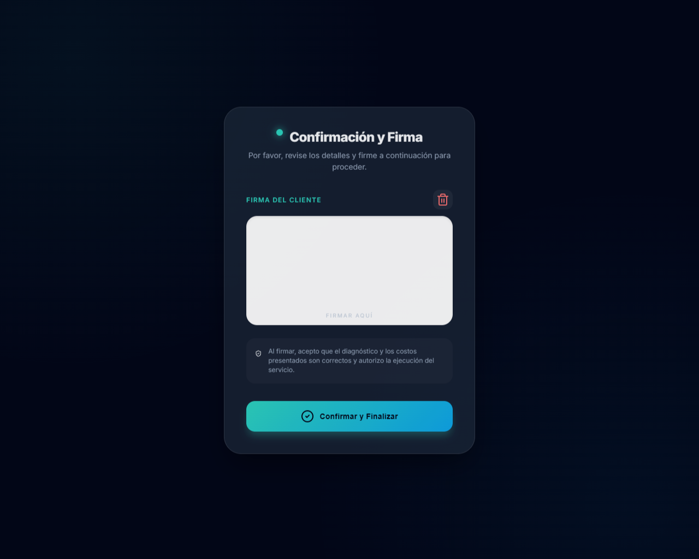

# ✒️ Herramienta de Confirmación y Firma (v1.0)



Esta es una herramienta autónoma, modular y de diseño premium diseñada para capturar firmas digitales de clientes de forma sencilla y elegante. Fue extraída originalmente del ecosistema **PCSupport-STG** para ser utilizada como un componente "Plug & Play" en cualquier proyecto web.

## 🚀 Características Principales

- **Diseño Premium**: Interfaz moderna con efectos de *Glassmorphism*, modo oscuro y tipografía optimizada.
- **Totalmente Autónoma**: No requiere frameworks (React, Vue, etc.). Funciona con HTML, CSS y JS puro.
- **Responsiva**: El área de firma se ajusta automáticamente al tamaño de la pantalla, ideal para tablets y móviles.
- **Salida Estándar**: Exporta la firma en formato **Base64 (PNG)**, lista para ser guardada en bases de datos o enviada por API.
- **Ligera**: Dependencias mínimas vía CDN (SignaturePad y Lucide Icons).

## 📂 Estructura de Archivos e Implementación

La implementación de la herramienta se divide en tres capas fundamentales que garantizan un funcionamiento óptimo y sin dependencias pesadas:

- **`index.html`**: Contiene la estructura semántica de la aplicación. Integra las fuentes de Google (Inter) y la librería de iconos Lucide mediante CDN. Posee la capa principal (`.confirm-container`) y la tarjeta glassmorphism (`.glass-card`).
- **`style.css`**: Responsable de la estética premium. Utiliza variables CSS para los colores (tonos teal y sky, propios de PCSupport-STG), implementa el efecto `backdrop-filter: blur(16px)` para el glassmorphism, y define animaciones suaves para la interacción de los botones y alertas.
- **`script.js`**: Maneja la lógica de captura mediante `SignaturePad`. Administra el canvas (ajustando dinámicamente su escala según el tamaño de la ventana para dispositivos de alta resolución o *Retina Displays*), captura la información en formato Base64 (`image/png`), y simula el flujo de carga al presionar "Confirmar".
- **`docker-compose.yml`**: Orquestación de contenedores para desarrollo o testing, mapeando el contenido estático mediante un servidor `nginx:alpine`.

## 🛠️ Cómo utilizar (Integración)

1. Copia los archivos a tu proyecto web.
2. Para integrar con tu propio backend, modifica la función de éxito en `script.js` (dentro del listener de `confirm-btn`):

```javascript
// Ejemplo de integración
confirmBtn.addEventListener('click', () => {
    // Validar que la firma no esté vacía
    if (signaturePad.isEmpty()) return alert("Por favor, proporcione una firma primero.");
    
    // Obtener la firma en base64
    const signatureData = signaturePad.toDataURL();
    
    // Envía los datos a tu API
    fetch('tu-api-endpoint', {
        method: 'POST',
        headers: { 'Content-Type': 'application/json' },
        body: JSON.stringify({ firma: signatureData })
    }).then(res => res.json()).then(data => {
        console.log("Firma guardada con éxito en la base de datos");
    });
});
```

## 📦 Despliegue Rápido (Docker)

La herramienta incluye una configuración optimizada con **Docker Compose** que levanta un servidor Nginx súper ligero. Este servidor se expone simultáneamente en los puertos **3004** y **9004**, de manera que no cause conflictos con otras aplicaciones de backend o frontend del ecosistema.

Para levantar el entorno de pruebas, simplemente ejecuta:

```bash
docker compose up -d
```

Una vez en ejecución, la herramienta estará disponible en:
- `http://localhost:3004`
- `http://localhost:9004`

---
**Desarrollado por Antigravity para PCSupport-STG**
